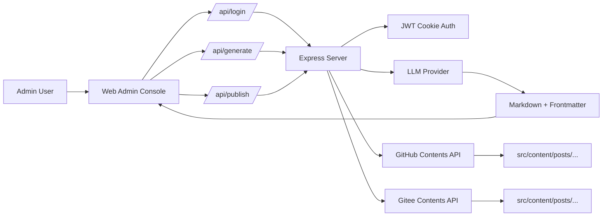

# post_admin

<p align="center">
An AI writing and publishing console built for Markdown-first blog authors.
</p>

<p align="center">


</p>

<p align="center">
<a href="https://github.com/Markfirst650/post_admin/stargazers"></a>
<a href="https://github.com/Markfirst650/post_admin/network/members"></a>
<a href="https://github.com/Markfirst650/post_admin/issues"></a>
<a href="https://github.com/Markfirst650/post_admin/blob/main/LICENSE"></a>
<a href="https://github.com/Markfirst650/post_admin/commits/main"></a>
</p>

<p align="center">
From a rough draft to a frontmatter-ready Markdown article to a push into your content repository, all in one place.
</p>

---

## Introduction

The pain of most content back offices is not a lack of features. It is workflow fragmentation.

When writing one post, you often jump between several contexts: chatting with a model, organizing frontmatter, polishing Markdown, deciding the file name, committing, and making sure CI does not run unnecessarily. Each step is small, but the context switching is expensive.

post_admin focuses on shortening that path. It is not a general CMS and does not try to replace your blog system. It solves one practical, high-frequency problem: turning ideas into clean, publishable Markdown and shipping it directly into your content repository.

> By default, this project publishes to src/content/posts/ and appends [skip ci] to commit messages, which is ideal for markdown-only content updates without triggering extra workflows.

---

## Highlights

- End-to-end flow in one page: login, generate, edit, preview, publish
- Strong output constraints: plain Markdown + YAML frontmatter
- Suggested file name extracted automatically from model output
- GitHub publishing with optional Gitee sync
- Automatic skip-CI marker for content-only commits
- Great fit for Astro, Nuxt Content, VitePress, Hexo, and other Markdown-driven sites

---

## Screenshots

### 1. Login Page


### 2. Generate and Publish Page


### 3. Fullscreen Split Preview


---

## Why It Is Useful

What this project really saves is not API calls. It saves context switches.

- No need to draft in a chat window and manually copy content back.
- No need to rebuild frontmatter structure every time.
- No need to repeatedly think about naming conventions before publish.
- No need to worry about accidental full CI/CD runs for normal content updates.

It does not replace your writing. It streamlines your publishing operations.

---

## Features

- Admin-password login with JWT Cookie auth on the server side
- Supports DeepSeek, OpenAI-compatible APIs, MiniMax, and GLM
- Forces generation output to Markdown body + YAML frontmatter
- Auto-fills published, updated, description, image, tags, and category
- Extracts suggested filename from model output
- Built-in Markdown editor for manual polishing
- Real-time render + immersive fullscreen split preview
- Publish to GitHub
- Optional sync to Gitee
- Optional overwrite for same-name files
- Auto-appends [skip ci] to commit messages

---

## Architecture



The architecture is intentionally simple: the frontend captures writing intent as structured input, and the backend handles auth, generation, and publishing. The final destination is your content repository, not a database.

---

## Tech Stack

- Node.js
- Express
- Vue 3 (CDN)
- Tailwind CSS (CDN)
- Axios
- Marked
- OpenAI Node SDK

---

## Project Structure

```text
post_admin/
 public/
   favicon.ico
   index.html
 .env.example
 package.json
 pnpm-lock.yaml
 README.md
 README.en.md
 server.js
```

---

## Workflow

1. Admin logs in; server validates password and issues JWT Cookie.
2. User fills title, tags, keywords, category, target length, and draft.
3. Server builds prompt and requests model output in blog-ready Markdown format.
4. Model returns content + frontmatter and a suggested filename.
5. User performs final edits and decides overwrite/sync options.
6. Server writes content to GitHub via the Contents API under src/content/posts/.
7. If enabled, the same content is synced to Gitee.

---

## Quick Start

### 1. Install Dependencies

Recommended:

```bash
pnpm install
```

Alternative:

```bash
npm install
```

### 2. Prepare Environment Variables

Copy the template:

```bash
cp .env.example .env
```

On Windows PowerShell:

```powershell
Copy-Item .env.example .env
```

Then fill .env with your model and repository settings.

### 3. Start Development Server

```bash
pnpm dev
```

or

```bash
npm run dev
```

### 4. Start Production Server

```bash
pnpm start
```

Default URL:

```text
http://localhost:3000
```

---

## Environment Variables

This repo already provides .env.example.

### Basic

- PORT: service port (default 3000)
- NODE_ENV: runtime mode; secure cookie in production
- ADMIN_PASSWORD: admin login password
- JWT_SECRET: JWT signing secret

### Model Provider Settings

- OPENAI_API_KEY: OpenAI or OpenAI-compatible API key
- OPENAI_BASE_URL: OpenAI-compatible base URL (optional)
- OPENAI_MODEL: default model name
- DEEPSEEK_API_KEY: DeepSeek API key
- DEEPSEEK_BASE_URL: DeepSeek API base URL
- GLM_API_KEY: GLM API key
- GLM_BASE_URL: GLM API base URL
- MINIMAX_API_KEY: MiniMax API key
- MINIMAX_BASE_URL: MiniMax API base URL

### GitHub Publish Settings

- GITHUB_OWNER: GitHub owner (user/org)
- GITHUB_REPO: target repository name
- GITHUB_BRANCH: target branch (default main)
- GITHUB_TOKEN: token with content write permission

### Gitee Publish Settings

- GITEE_OWNER: Gitee owner (user/org)
- GITEE_REPO: target Gitee repository name
- GITEE_BRANCH: target branch (default master)
- GITEE_TOKEN: Gitee access token

---

## Usage

### Step 1: Login

Use ADMIN_PASSWORD from .env.

### Step 2: Configure Generation Parameters

Fill in the left panel:

- provider and model
- article title
- cover image URL
- category, tags, keywords
- target length
- draft, key points, or writing instructions

Title is required.

### Step 3: Generate Markdown

After clicking the generate button, the server requests the model to:

- output plain Markdown only
- include YAML frontmatter at the top
- generate structured metadata from your input
- append a suggested filename at the end

The result is written directly into the right editor panel.

### Step 4: Review and Publish

Edit manually if needed, then set:

- final file path
- commit message
- overwrite option
- Gitee sync option

Click publish to push content into your repository.

---

## Prompt Optimization Guide (Match Your Blog Format)

If your blog has strict frontmatter and content structure requirements, the best strategy is to move those constraints into the prompt instead of fixing every article manually.

### 1. Define a Format Contract

List all fixed fields and rules, such as:

- title, published, updated, description
- whether image is required
- whether tags must be an array
- whether category is restricted
- default draft value

Write these as hard requirements, not suggestions.

### 2. Put a Frontmatter Template in the Prompt

Use a template like this and replace field names with your own:

```text
You are my blog writing assistant. Output plain Markdown only, with no explanations.

You must output YAML frontmatter at the very top using this exact format:
---
title: {TITLE}
published: {TODAY}
updated: {TODAY}
description: '{AUTO_SUMMARY}'
image: '{IMAGE_URL}'
tags: [{TAGS}]
category: '{CATEGORY}'
draft: false
---

Hard requirements:
1) Keep the field order unchanged.
2) Auto-fill missing values with reasonable defaults.
3) Use structured Markdown in the body (h2/h3, lists, quotes, highlights).
4) Append this marker at the end: <!--- FILENAME: english-file-name.md --->
```

### 3. Add Content Structure Instructions

If you want stable writing style, define the body skeleton:

- opening: background + reader pain points
- middle: 3 key ideas, each with an example
- ending: summary + actionable checklist

This greatly reduces style drift between runs.

### 4. Add Negative Constraints

Explicitly forbid common failures:

- do not print phrases like Here is your article
- do not wrap the entire article in a code block
- do not omit frontmatter
- do not add generic off-topic paragraphs

Clear constraints mean less rework.

### 5. Use a Two-Pass Generation Strategy

Recommended process:

1. First pass: outline + frontmatter draft only.
2. Second pass: full article after structure confirmation.

This gives better control than one-shot long generation.

### 6. Better Input Strategy

- title: specific and searchable
- keywords: keep it to 3-6 core terms
- draft: provide bullet points instead of large unstructured text
- targetLength: use a range (for example 1200-1800)

Input quality directly affects output quality.

### 7. Common Issues and Fixes

- Issue: tags generated as a string.
  Fix: add tags must be a YAML array.
- Issue: description is too long.
  Fix: limit it, e.g. description must be <= 80 Chinese characters or <= 160 English characters.
- Issue: heading levels are messy.
  Fix: specify body starts from h2 and no level skipping.

Once these fixes are written into your prompt, output quality becomes much more stable.

---

## Publishing Convention

Current default destination:

```text
src/content/posts/
```

This works best for blog systems that:

- are Markdown-driven
- support frontmatter
- keep a stable content directory layout

If your project uses a different content path, update the publish logic on the server side.

---

## Commit Strategy

The project checks whether your commit message already contains a skip-CI marker. If not, it appends [skip ci] automatically.

Recognized markers:

- [skip ci]
- [ci skip]
- [no ci]
- [skip actions]
- [actions skip]

For content repositories, this prevents unnecessary workflow runs.

---

## API Overview

### Auth APIs

- POST /api/login/: login
- POST /api/logout/: logout
- GET /api/check-auth/: check auth state

### Content APIs

- POST /api/generate/: generate Markdown content from model
- POST /api/publish/: publish to GitHub with optional Gitee sync

---

## Security Notes

- Current auth model is suitable for personal or small-team use
- Use strong values for ADMIN_PASSWORD and JWT_SECRET
- Do not commit .env to public repositories
- Use HTTPS and reverse proxy in production
- Grant GitHub/Gitee tokens only the minimum required permissions

---

## Who This Is For

- Independent developers using Markdown as content source
- Authors maintaining Astro/Nuxt Content/VitePress/Hexo style content sites
- Teams that want a stable workflow: AI draft + human review + one-click publish

---

## Roadmap

- .env validation before startup
- prompt template management and scenario presets
- publish history and operation logs
- auto-save for drafts
- frontmatter validation and Markdown quality checks
- customizable publish destination directory
- multi-user and fine-grained permission control

---

## License

This project is licensed under MIT. See LICENSE for details.
