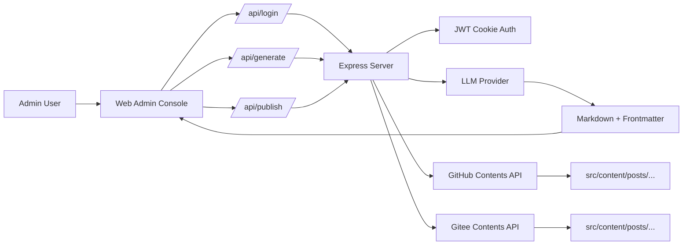

# post_admin

<p align="center">
<a href="README.md">简体中文</a> | <a href="README.en.md">English</a>
</p>

<p align="center">
一个为 Markdown 博客作者设计的 AI 写作与发布管理系统。
</p>

<p align="center">


</p>

<p align="center">
<a href="https://github.com/Markfirst650/post_admin/stargazers"></a>
<a href="https://github.com/Markfirst650/post_admin/network/members"></a>
<a href="https://github.com/Markfirst650/post_admin/issues"></a>
<a href="https://github.com/Markfirst650/post_admin/blob/main/LICENSE"></a>
<a href="https://github.com/Markfirst650/post_admin/commits/main"></a>
</p>

<p align="center">
从一个草稿开始，到一篇带 frontmatter 的 Markdown 文章，再到推送进内容仓库，整个链路收束在同一个页面里。
</p>

---

## 项目简介

大多数内容后台的问题，不在于按钮太少，而在于流程太碎。

你写一篇文章，往往会在这几件事之间来回切换：和模型对话、整理 frontmatter、润色 Markdown、决定文件名、提交到仓库、确认是否触发工作流。每一个步骤单看都不复杂，但串起来就会很消耗注意力。

post_admin 的目标很明确：把生成、校对、预览、命名、提交、发布压缩成一条短路径。它不是一个通用 CMS，也不试图接管你的博客系统；它只专注解决一个足够高频、也足够实际的问题：如何更快地把一篇内容安全、整洁、可落库地送进你的 Markdown 内容仓库。

> 当前版本默认将文章发布到 `src/content/posts/`，并自动为提交信息追加 `[skip ci]`，适合只推送 md 内容，不触发额外工作流的内容发布模式。

---

## 项目亮点

- 单页完成登录、生成、编辑、预览、发布
- 强约束模型输出 Markdown 纯文本和 YAML frontmatter
- 自动生成建议文件名，减少手动命名成本
- 支持 GitHub 发布，并可选同步到 Gitee
- 提交信息自动补充跳过 CI 标记，避免无意义构建
- 适合 Astro、Nuxt Content、VitePress、Hexo 等 Markdown 驱动站点

---

## 界面预览

### 1. 登录页


### 2. 内容生成与发布页


### 3. 全屏双栏预览


---

## 为什么它真的有用

这个项目真正节省的，不是 API 调用次数，而是上下文切换。

- 你不需要先去聊天窗口生成初稿，再手动复制回编辑器。
- 你不需要每次都重新组织 frontmatter 字段。
- 你不需要在提交前再想一遍文件名应该怎么取。
- 你不需要担心一次普通内容更新误触发整条 CI/CD 流程。

它做的不是替你写作，而是把一套原本分散的发布动作变成一个连续动作。

---

## 功能特性

- 管理员密码登录，服务端基于 JWT Cookie 做鉴权
- 支持 `DeepSeek`、`OpenAI 兼容接口`、`MiniMax`、`GLM`
- 生成结果强制为 Markdown 正文 + YAML frontmatter
- 自动填充 `published`、`updated`、`description`、`image`、`tags`、`category`
- 自动从模型输出中提取建议文件名
- 内置 Markdown 编辑区，支持二次润色
- 支持实时渲染和全屏双栏沉浸式预览
- 支持推送到 GitHub
- 支持可选同步到 Gitee
- 支持同名文件覆盖发布
- 自动为 commit message 追加 `[skip ci]`

---

## 系统架构



这套结构并不复杂，但足够有效：前端负责把写作意图组织成结构化输入，服务端负责鉴权、生成和发布，最终目标不是数据库，而是你的内容仓库本身。

---

## 技术栈

- Node.js
- Express
- Vue 3（CDN）
- Tailwind CSS（CDN）
- Axios
- Marked
- OpenAI Node SDK

---

## 项目结构

```text
post_admin/
 public/
   favicon.ico
   index.html
 .env.example
 package.json
 pnpm-lock.yaml
 README.md
 server.js
```

---

## 工作流说明

整个发布链路大致如下：

1. 管理员输入后台密码，服务端验证后下发 JWT Cookie。
2. 用户填写标题、标签、关键词、分类、目标字数和草稿内容。
3. 服务端根据表单内容构造 Prompt，请模型返回符合博客规范的 Markdown。
4. 模型输出正文、frontmatter，并在尾部附带建议文件名。
5. 用户在编辑区进行最终校对，并决定是否覆盖同名文件、是否同步 Gitee。
6. 服务端通过 GitHub Contents API 写入 `src/content/posts/`。
7. 如果启用同步，则继续把同一份内容推送到 Gitee。

---

## 快速开始

### 1. 安装依赖

推荐使用 pnpm：

```bash
pnpm install
```

也可以使用 npm：

```bash
npm install
```

### 2. 准备环境变量

复制示例配置：

```bash
cp .env.example .env
```

Windows PowerShell 可以这样做：

```powershell
Copy-Item .env.example .env
```

然后按你的实际模型和仓库配置填写 `.env`。

### 3. 启动开发服务

```bash
pnpm dev
```

或：

```bash
npm run dev
```

### 4. 启动生产服务

```bash
pnpm start
```

默认访问地址：

```text
http://localhost:3000
```

---

## 环境变量说明

仓库已经提供示例文件：`.env.example`。

### 基础配置

- `PORT`: 服务端口，默认 `3000`
- `NODE_ENV`: 运行环境，生产环境下 Cookie 会启用 `secure`
- `ADMIN_PASSWORD`: 管理后台登录密码
- `JWT_SECRET`: JWT 签名密钥

### 模型服务配置

- `OPENAI_API_KEY`: OpenAI 或兼容接口密钥
- `OPENAI_BASE_URL`: OpenAI 兼容接口地址，可留空
- `OPENAI_MODEL`: 默认模型名
- `DEEPSEEK_API_KEY`: DeepSeek 密钥
- `DEEPSEEK_BASE_URL`: DeepSeek 接口地址
- `GLM_API_KEY`: GLM 密钥
- `GLM_BASE_URL`: GLM 接口地址
- `MINIMAX_API_KEY`: MiniMax 密钥
- `MINIMAX_BASE_URL`: MiniMax 接口地址

### GitHub 发布配置

- `GITHUB_OWNER`: GitHub 用户名或组织名
- `GITHUB_REPO`: 目标仓库名
- `GITHUB_BRANCH`: 目标分支，默认 `main`
- `GITHUB_TOKEN`: 具有内容写入权限的 Token

### Gitee 发布配置

- `GITEE_OWNER`: Gitee 用户名或组织名
- `GITEE_REPO`: Gitee 仓库名
- `GITEE_BRANCH`: 目标分支，默认 `master`
- `GITEE_TOKEN`: Gitee 访问令牌

---

## 使用指南

### 第 1 步：登录后台

使用 `.env` 中配置的 `ADMIN_PASSWORD` 登录。

### 第 2 步：配置生成参数

在左侧面板中填写：

- Provider 与 Model
- 文章标题
- 封面图链接
- 分类、标签、关键词
- 目标篇幅
- 草稿、要点或写作指令

其中标题为必填项。

### 第 3 步：生成 Markdown

点击智能生成 Markdown后，服务端会要求模型：

- 仅输出 Markdown 纯文本
- 在顶部输出 YAML frontmatter
- 基于你的输入自动生成描述和结构化元信息
- 在结尾给出建议文件名

生成后的结果会直接写入右侧编辑器。

### 第 4 步：复查并发布

你可以继续手动修改内容，然后填写：

- 最终文件路径
- 提交信息
- 是否覆盖同名文件
- 是否同步到 Gitee

确认后点击发布按钮，即可把文章推送到内容仓库。

---

## 提示词优化教程（按你的博客格式定制）

如果你的博客 frontmatter 字段和正文结构有固定规范，最有效的做法不是不断手动改稿，而是把规范前置到 Prompt。

### 1. 先定义你的格式契约

建议先整理一份你博客文章的固定字段和约束，例如：

- `title`、`published`、`updated`、`description`
- `image` 是否必填
- `tags` 是否必须数组
- `category` 是否限定取值
- `draft` 默认值

把它们写成必须遵守的规则，而不是尽量参考。

### 2. 把 frontmatter 模板写进 Prompt

下面是一个可直接改造的模板（把字段名改成你的博客实际格式）：

```text
你是我的博客写作助手。请严格输出 Markdown 纯文本，不要输出任何解释。

必须在最顶部输出 YAML frontmatter，格式如下：
---
title: {TITLE}
published: {TODAY}
updated: {TODAY}
description: '{AUTO_SUMMARY}'
image: '{IMAGE_URL}'
tags: [{TAGS}]
category: '{CATEGORY}'
draft: false
---

硬性要求：
1) frontmatter 字段顺序不能变。
2) 缺失信息请你自动补齐合理值。
3) 正文必须使用 Markdown 结构化输出（h2/h3、列表、引用、重点块）。
4) 文末追加：<!--- FILENAME: english-file-name.md --->
```

### 3. 加上内容结构指令

如果你希望文章风格稳定，建议再明确正文骨架，比如：

- 开头：背景 + 读者痛点
- 中段：3 个核心观点，每个观点给示例
- 结尾：总结 + 可执行清单

这会显著降低同样参数，每次结构完全不同的问题。

### 4. 用反例约束减少跑偏

你可以在 Prompt 里明确禁止项：

- 不要输出以下是文章内容这类解释句
- 不要输出代码块包裹整个 Markdown
- 不要省略 frontmatter
- 不要出现与主题无关的泛化段落

规则越清楚，返工越少。

### 5. 用两段式迭代提高质量

推荐流程：

1. 第一轮只生成提纲 + frontmatter 草案。
2. 你确认结构后，第二轮再生成完整正文。

相比一次性出全文，这种方式更稳，也更容易控制文章调性。

### 6. 建议的参数输入策略

- `title`: 具体、可检索，不要太抽象
- `keywords`: 3 到 6 个核心关键词即可
- `draft`: 提供要点而非大段堆叠
- `targetLength`: 用区间更好（例如 `1200-1800`）

这些输入质量直接决定生成上限。

### 7. 常见问题与修复

- 问题：`tags` 输出成字符串而不是数组。
  修复：在 Prompt 中补一句tags 必须是 YAML 数组。
- 问题：`description` 太长。
  修复：增加限制description 不超过 80 字。
- 问题：标题层级混乱。
  修复：明确正文从二级标题开始，禁止跳级。

把这些修复沉淀进 Prompt 后，后续每次生成都会更稳定。

---

## 发布约定

当前版本默认把文章写入：

```text
src/content/posts/
```

因此它更适合以下类型的博客系统：

- 基于 Markdown 文件驱动内容
- 支持 frontmatter
- 内容目录结构稳定

如果你的博客目录并不是这个路径，可以按需调整服务端发布逻辑。

---

## 提交策略

项目会自动检查提交信息中是否已包含跳过 CI 的标记。如果没有，会自动追加 `[skip ci]`。

当前识别这些标记：

- `[skip ci]`
- `[ci skip]`
- `[no ci]`
- `[skip actions]`
- `[actions skip]`

这个细节对内容仓库尤其重要，因为一次普通的文章更新并不一定值得触发完整工作流。

---

## 接口概览

### 鉴权接口

- `POST /api/login/`: 登录
- `POST /api/logout/`: 退出登录
- `GET /api/check-auth/`: 检查当前登录状态

### 内容接口

- `POST /api/generate/`: 调用模型生成 Markdown 内容
- `POST /api/publish/`: 发布到 GitHub，并可选同步到 Gitee

---

## 安全说明

- 当前鉴权模型适合个人或小范围团队自用
- 请为 `ADMIN_PASSWORD` 和 `JWT_SECRET` 使用强值
- 不要将 `.env` 提交到公开仓库
- 生产环境建议放在 HTTPS 和反向代理之后
- GitHub/Gitee Token 只授予必要权限

---

## 适用人群

- 使用 Markdown 作为内容源的独立开发者
- 维护 Astro、Nuxt Content、VitePress、Hexo 等内容型站点的作者
- 希望把AI 起草 + 人工校稿 + 一键入库串成稳定工作流的人

---

## 迭代路线

- 增加 `.env` 校验与启动前检查
- 增加 prompt 模板管理和写作场景预设
- 增加发布历史和操作日志
- 增加文章草稿自动保存
- 增加 frontmatter 校验和 Markdown 质量检查
- 增加自定义目标发布目录
- 增加多用户与细粒度权限控制

---

## 开源协议

本项目使用 MIT License，详见 `LICENSE` 文件。
